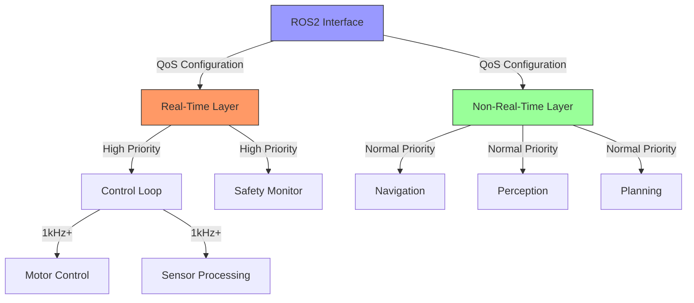

# ADR 0002: Real-Time Architecture for ROS2 Robotics Systems

## Status
**Accepted** ✅

## Context

As we develop professional ROS2 applications for robotics, we need to address real-time requirements that are common in:

1. **Motor control loops** (1kHz+ update rates)
2. **Sensor processing pipelines** (high-frequency data streams)
3. **Safety-critical systems** (emergency stop handling)
4. **Closed-loop control systems** (PID controllers, trajectory tracking)

Standard ROS2 configurations may not provide the determinism and low-latency required for these applications.

## Decision

### 1. Real-Time Architecture Pattern

**Adopt a layered real-time architecture:**



### 2. Real-Time Implementation Strategy

**Core Components:**

1. **Real-Time Executor**: Custom multi-threaded executor with priority management
2. **Memory Management**: Pre-allocated memory pools to avoid dynamic allocation
3. **Thread Priorities**: Proper thread priority configuration
4. **QoS Configuration**: Appropriate Quality of Service settings

**Implementation Pattern:**

```cpp
// Real-time executor configuration
PrioritizedMultiThreadedExecutor executor(
    2,  // High priority threads for real-time tasks
    4,  // Normal priority threads for non-real-time tasks
    1   // Low priority thread for monitoring
);

// Add nodes with appropriate priorities
executor.add_node(motor_controller, ThreadPriority::HIGH);
executor.add_node(sensor_processor, ThreadPriority::HIGH);
executor.add_node(navigation_stack, ThreadPriority::NORMAL);
executor.add_node(monitoring_node, ThreadPriority::LOW);
```

### 3. Memory Management Strategy

**Object Pool Pattern:**

```cpp
// Pre-allocate memory for real-time operations
MemoryPool<sensor_msgs::msg::PointCloud2> point_pool_(100);
MemoryPool<std::array<float, 30000>> processing_pool_(50);

// Use pre-allocated memory in real-time loop
auto* processing_buffer = processing_pool_.acquire();
if (!processing_buffer) {
    // Handle pool exhaustion gracefully
    return;
}

// Process data
process_data_safely(msg->data, processing_buffer);

// Return buffer to pool
processing_pool_.release(processing_buffer);
```

### 4. Thread Priority Configuration

**Platform-Specific Implementation:**

```cpp
void set_real_time_priority() {
    #ifdef __linux__
    // Linux real-time priority setup
    struct sched_param param;
    param.sched_priority = 99; // Maximum RT priority
    
    if (pthread_setschedparam(pthread_self(), SCHED_FIFO, &param) != 0) {
        RCLCPP_ERROR(get_logger(), "Failed to set real-time priority");
        // Fallback to normal priority
    }
    #elif _WIN32
    // Windows real-time priority setup
    if (!SetThreadPriority(GetCurrentThread(), THREAD_PRIORITY_TIME_CRITICAL)) {
        RCLCPP_ERROR(get_logger(), "Failed to set real-time priority");
    }
    #endif
}
```

### 5. QoS Configuration for Real-Time

**Appropriate QoS Settings:**

```cpp
// Real-time sensor data QoS
auto qos = rclcpp::QoS(rclcpp::KeepLast(1));
qos.reliability(RCL_BEST_EFFORT);  // Low latency
qos.durability(RCL_VOLATILE);      // No persistence
qos.lifetime(rclcpp::Duration(100ms)); // Short lifetime

// Critical control command QoS
auto control_qos = rclcpp::QoS(rclcpp::KeepLast(1));
control_qos.reliability(RCL_RELIABLE); // Must arrive
control_qos.durability(RCL_TRANSIENT_LOCAL); // Persist briefly
control_qos.lifetime(rclcpp::Duration(200ms));
```

### 6. Error Handling and Recovery

**Real-Time Error Handling Pattern:**

```cpp
void control_loop() {
    try {
        // Real-time control logic
        auto data = acquire_sensor_data();
        auto command = compute_control_command(data);
        send_motor_command(command);
        
    } catch (const std::exception& e) {
        RCLCPP_ERROR_THROTTLE(get_logger(), *get_clock(), 1000,
                             "Control loop error: %s", e.what());
        
        // Graceful degradation
        send_safe_stop_command();
        request_recovery();
        
    } catch (...) {
        RCLCPP_ERROR_THROTTLE(get_logger(), *get_clock(), 1000,
                             "Unknown error in control loop");
        send_emergency_stop();
    }
}
```

### 7. Performance Monitoring

**Real-Time Monitoring Pattern:**

```cpp
void monitor_performance() {
    auto end_time = std::chrono::high_resolution_clock::now();
    auto elapsed = std::chrono::duration_cast<std::chrono::microseconds>
        (end_time - start_time);
    
    if (elapsed > control_period) {
        RCLCPP_WARN_THROTTLE(get_logger(), *get_clock(), 1000,
                            "Control loop overrun: %lld μs",
                            elapsed.count() - control_period.count());
        
        // Trigger performance optimization
        optimize_control_loop();
    }
}
```

## Consequences

### Positive Consequences

1. **Deterministic Performance**: Achieves predictable timing for critical operations
2. **Low Latency**: Minimizes response times for control systems
3. **Reliability**: Improves system stability under load
4. **Safety**: Enables proper handling of safety-critical functions
5. **Scalability**: Supports complex robotic systems with mixed real-time requirements

### Negative Consequences

1. **Increased Complexity**: Real-time systems are more complex to design and maintain
2. **Platform Dependencies**: Real-time features often require platform-specific code
3. **Debugging Challenges**: Real-time issues can be difficult to debug
4. **Resource Requirements**: May require dedicated CPU cores or specialized hardware
5. **Testing Complexity**: Requires specialized testing for real-time behavior

### Mitigation Strategies

1. **Abstraction Layers**: Hide platform-specific details behind clean interfaces
2. **Comprehensive Logging**: Detailed logging for debugging real-time issues
3. **Performance Profiling**: Regular profiling to identify bottlenecks
4. **Documentation**: Clear documentation of real-time requirements and constraints
5. **Testing Frameworks**: Specialized testing for real-time behavior verification

## Alternatives Considered

### Alternative 1: Standard ROS2 Executors Only
**Rejected because:** Cannot meet strict real-time requirements for motor control and safety systems.

### Alternative 2: External Real-Time Framework
**Rejected because:** Increases complexity and may not integrate well with ROS2 ecosystem.

### Alternative 3: Hardware-Specific Solutions
**Rejected because:** Limits portability and increases hardware dependencies.

## Future Considerations

1. **Real-Time ROS2 Extensions**: Monitor and adopt official ROS2 real-time extensions
2. **Hardware Acceleration**: Explore GPU/FPGA acceleration for sensor processing
3. **Advanced Scheduling**: Investigate more sophisticated scheduling algorithms
4. **Formal Verification**: Consider formal methods for safety-critical components
5. **Benchmarking**: Develop comprehensive real-time performance benchmarks

## References

- ROS2 Real-Time Working Group recommendations
- POSIX real-time extensions documentation
- Real-time Linux configuration guides
- Robotics control theory references
- Safety standards for robotic systems

**Approved by:** @michael
**Date:** 2024-03-15
**Last Updated:** 2024-03-15