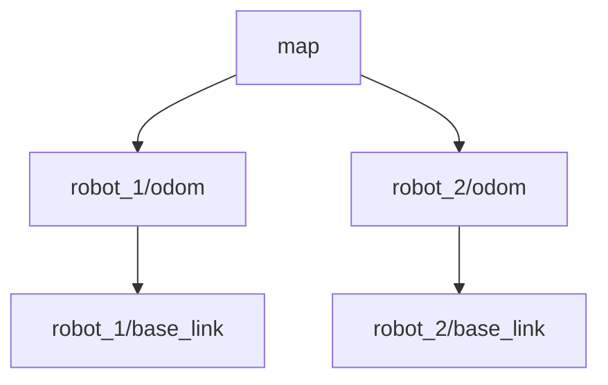

# Building ROS 2 Software for Multi-Robot Deployment

Deploying software across a fleet of robots introduces complexities that effectively don't exist in single-robot development. Dealing with shared networks, coordinate frame clashes, and fleet management requires a deliberate architectural approach from day one.

## 1. The Core Challenge: Identity & Isolation

In a single-robot setup, topics like `/scan`, `/cmd_vel`, and frames like `base_link` are unambiguous. In a multi-robot system, if Robot A and Robot B both publish to `/scan`, your navigation stack will see a "ghost" wall jumping between two locations.

### The Golden Rule: Namespacing

Every robot must exist within its own unique namespace.

**Instead of:**
- Topic: `/cmd_vel`
- Node: `navigation_node`
- Frame: `base_link`

**You must have:**
- Topic: `/robot_01/cmd_vel`
- Node: `/robot_01/navigation_node`
- Frame: `robot_01/base_link`

### Implementation Strategy

Do not hardcode namespaces in your C++/Python code. Use the ROS 2 launch system to push namespaces down.

**Launch File Approach:**
```python
# multi_robot_launch.py
from launch.actions import GroupAction
from launch_ros.actions import PushRosNamespace

def generate_launch_description():
    robot_name = "robot_01"
    
    return LaunchDescription([
        GroupAction([
            PushRosNamespace(robot_name),
            IncludeLaunchDescription(
                PythonLaunchDescriptionSource('robot_bringup.launch.py'),
                launch_arguments={'frame_prefix': robot_name + '/'}.items()
            )
        ])
    ])
```

## 2. Coordinate Frames & TF

The standard TF tree is `map -> odom -> base_link`. 
If you have multiple robots, they cannot all transform `odom` to `base_link`, because `base_link` is ambiguous.

**Multi-Robot TF Tree:**


### Tips for TF
1.  **Frame Prefixing**: Ensure your URDF/xacro files utilize a `prefix` argument that is prepended to all link and joint names.
2.  **Map Frame**: Usually, there is only one shared `map` frame (world origin).
3.  **Localization**: AMCL/SLAM needs to be configured to provide the transform from `map` to `robot_X/odom`.

## 3. Network & DDS Discovery

ROS 2 uses DDS (Data Distribution Service) which relies on multicast for discovery. On a shared WiFi network with 50 robots, this becomes the primary bottleneck.

### Scaling Strategies

#### A. ROS_DOMAIN_ID
If robots **do not** need to talk to each other (e.g., they only talk to a central server), separating them logically is simplest.
- Robot 1: `export ROS_DOMAIN_ID=1`
- Robot 2: `export ROS_DOMAIN_ID=2`
- Fleet Server: Needs to bridge these domains (complex) or use a discovery server.

#### B. FastDDS Discovery Server
This is the recommended approach for large fleets. Instead of every node yelling "I'm here!" to everyone else (Mesh topology), nodes register with a central server (Star topology).

**Configuring Client:**
```xml
<!-- fastdds_client.xml -->
<profiles>
    <participant profile_name="participant_profile_ros2" is_default_profile="true">
        <rtps>
            <builtin>
                <discovery_config>
                    <discoveryProtocol>CLIENT</discoveryProtocol>
                    <discoveryServersList>
                        <RemoteServer prefix="44.53.00.5f.45.50.52.4f.53.00.00.00">
                            <metatrafficUnicastLocatorList>
                                <locator>
                                    <udpv4>
                                        <address>192.168.1.100</address> <!-- Server IP -->
                                        <port>11811</port>
                                    </udpv4>
                                </locator>
                            </metatrafficUnicastLocatorList>
                        </RemoteServer>
                    </discoveryServersList>
                </discovery_config>
            </builtin>
        </rtps>
    </participant>
</profiles>
```

#### C. Zenoh-Bridge-DDS
For robots communicating over the internet or unreliable WiFi, Zenoh is far superior to raw DDS.
- Run a `zenoh-bridge-dds` on each robot.
- Run a `zenoh-router` in the cloud/server.
- The bridge efficiently tunnels ROS 2 data.

## 4. Time Synchronization
Robots relying on sensor fusion or coordinating maneuvers must have synchronized clocks.
- **NTP (Network Time Protocol)**: Standard for general sync.
- **PTP (Precision Time Protocol)**: Required for hardware-level hardware triggering or high-speed sensor fusion.
- **Chrony**: Highly recommended over standard `ntpd` for mobile robots involving intermittent network connections.

## 5. Deployment Pipelines (DevOps)

How do you update software on 20 robots?

1.  **Containerization (Docker)**:
    - Ship images, not code.
    - Ensure identical environments on Dev and Prod.
    - Use `host` networking for simplified DDS access, or carefully map UDP ports.

2.  **Configuration Management (Ansible)**:
    - Use Ansible to trigger `docker pull` and `docker restart` across the fleet.
    - Manage `/etc/hosts`, udev rules, and network configs.

3.  **Blue/Green Deployment**:
    - Update the software on a secondary partition/container.
    - Verify health parameters.
    - Switch traffic/control to usage.
    - Rollback instantly if metrics fail.

## 6. Fleet Management Architecture

**Centralized (Cloud Control)**:
- Robots are "puppets".
- Pros: Global optimization of traffic.
- Cons: Single point of failure; latency sensitive.

**Decentralized (Swarm)**:
- Robots negotiate via peer-to-peer (e.g., Open-RMF or custom logic).
- Pros: Robust to network loss.
- Cons: Harder to debug and optimize globally.

**Hybrid (Open-RMF)**:
- Open Robotics Middleware Framework (Open-RMF) provides a standard for interoperability between different robot fleets (e.g., a cleaner bot and a delivery bot) sharing space (elevators, doors, corridors).

## Recommendations

1.  **Start with Namespaces**: Even for a single robot, design as if there will be two. It costs nothing and saves a rewrite later.
2.  **Use Docker**: Don't depend on the robot's OS state.
3.  **Plan for Network Failure**: Your software should safely stop if the fleet manager disconnects.
4.  **Monitor Bandwidth**: Use `ros2 topic bw` in testing. 10 robots sending pointclouds will kill your WiFi.
