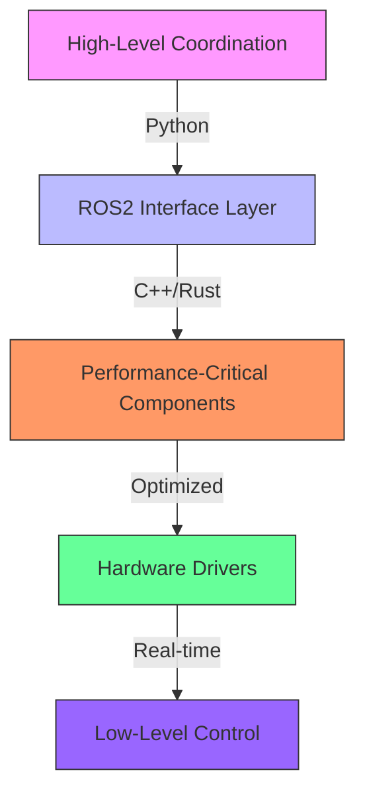

# ROS2 Language Choice Guide

## Decision Matrix: When to Use Each Language

This guide helps you choose the right language for your ROS2 project based on technical requirements, team expertise, and project constraints.

### Comprehensive Comparison

| Criteria                | C++ (rclcpp)                          | Python (rclpy)                        | Rust (rclrs)                          |
|-------------------------|---------------------------------------|---------------------------------------|---------------------------------------|
| **Performance**         | ⭐⭐⭐⭐⭐ (Native speed, zero overhead) | ⭐⭐⭐ (Interpreted, GIL limitations)   | ⭐⭐⭐⭐⭐ (Native speed, no GC)         |
| **Development Speed**   | ⭐⭐⭐ (Compile time, verbose)          | ⭐⭐⭐⭐⭐ (Interactive, dynamic)        | ⭐⭐⭐⭐ (Compile time, expressive)      |
| **Memory Safety**       | ⭐⭐ (Manual management)               | ⭐⭐⭐⭐ (GC managed)                   | ⭐⭐⭐⭐⭐ (Compile-time guarantees)      |
| **Ecosystem Maturity**  | ⭐⭐⭐⭐⭐ (Most mature)                | ⭐⭐⭐⭐ (Very mature)                  | ⭐⭐⭐ (Growing rapidly)                |
| **Real-time Capability**| ⭐⭐⭐⭐⭐ (Deterministic)               | ⭐⭐ (GIL, non-deterministic)          | ⭐⭐⭐⭐ (Predictable performance)       |
| **Learning Curve**      | ⭐⭐⭐ (Complex, steep)                | ⭐⭐⭐⭐⭐ (Beginner friendly)           | ⭐⭐ (Complex ownership model)         |
| **ROS2 Integration**    | ⭐⭐⭐⭐⭐ (Native, most features)      | ⭐⭐⭐⭐ (Full featured)                | ⭐⭐⭐ (Core features, growing)         |
| **Concurrency**         | ⭐⭐⭐⭐ (Multi-threading)              | ⭐⭐ (GIL limited)                     | ⭐⭐⭐⭐ (Fearless concurrency)          |
| **Error Handling**       | ⭐⭐⭐ (Exceptions, manual checks)      | ⭐⭐⭐ (Exceptions, dynamic typing)     | ⭐⭐⭐⭐⭐ (Compile-time checks)          |
| **Tooling**             | ⭐⭐⭐⭐ (Mature: gdb, valgrind)        | ⭐⭐⭐⭐ (Great: pdb, pytest)           | ⭐⭐⭐ (Growing: rust-gdb, clippy)      |
| **Deployment**          | ⭐⭐⭐⭐ (Cross-compile, small binaries)| ⭐⭐ (Interpreter dependency)          | ⭐⭐⭐⭐ (Small binaries, no runtime)   |

## When to Choose Each Language

### 🔧 Choose C++ (rclcpp) When:

**✅ Ideal Use Cases:**
- **High-performance robotics** (real-time control, sensor processing)
- **Resource-constrained systems** (embedded platforms, microcontrollers)
- **Mission-critical applications** (autonomous vehicles, medical robots)
- **Long-running production systems** (industrial automation)
- **When you need maximum control** over memory and threading

**📋 Example Projects:**
- Real-time motor controllers
- High-frequency sensor processing (LiDAR, camera streams)
- Autonomous vehicle perception stacks
- Industrial robot arm control systems
- Safety-critical applications

**⚠️ Considerations:**
- Longer development cycles due to compile times
- Higher risk of memory-related bugs
- Steeper learning curve for new developers
- More verbose code for simple tasks

### 🐍 Choose Python (rclpy) When:

**✅ Ideal Use Cases:**
- **Rapid prototyping and experimentation**
- **Research and algorithm development**
- **Data analysis and visualization**
- **High-level coordination and orchestration**
- **Education and teaching ROS2 concepts**
- **When development speed is critical**

**📋 Example Projects:**
- Research algorithms and proof-of-concept systems
- Data collection and analysis pipelines
- High-level behavior trees and state machines
- Simulation environments and testing frameworks
- Educational tutorials and examples
- Rapid iteration on ML/AI components

**⚠️ Considerations:**
- Performance limitations for real-time systems
- Global Interpreter Lock (GIL) limits multi-threading
- Higher memory usage for large-scale systems
- Not suitable for safety-critical applications

### 🦀 Choose Rust (rclrs) When:

**✅ Ideal Use Cases:**
- **Safety-critical systems requiring memory safety**
- **Long-running applications where reliability is paramount**
- **Performance-sensitive applications with safety requirements**
- **When you want C++ performance with memory safety**
- **Modern codebases with focus on correctness**

**📋 Example Projects:**
- Autonomous vehicle control systems
- High-reliability industrial robots
- Long-duration space/marine robotics
- Security-sensitive robotic applications
- Next-generation robotics frameworks

**⚠️ Considerations:**
- Smaller ecosystem compared to C++/Python
- Steeper learning curve (ownership model)
- Longer compile times than Python
- Less mature ROS2 integration than C++/Python

## Hybrid Approach: Best of Both Worlds

**Recommended Architecture Pattern:**



**Example Hybrid System:**
```bash
# Python for high-level coordination
ros2 run navigation_stack behavior_planner.py

# C++ for real-time control
ros2 run motor_controller motor_driver_node

# Rust for safety-critical components
ros2 run safety_system emergency_stop_monitor
```

## Language-Specific Patterns

### C++ Patterns
- **Memory Pooling** for real-time systems
- **Multi-threaded Executors** for parallel processing
- **Zero-copy Message Passing** for performance
- **RAII** for resource management

### Python Patterns
- **Dynamic Parameter Loading** for rapid iteration
- **Interactive Debugging** with IPython
- **NumPy Integration** for data processing
- **Async/Await** for non-blocking operations

### Rust Patterns
- **Fearless Concurrency** for thread safety
- **Compile-time Guarantees** for memory safety
- **Trait-based Design** for modularity
- **Zero-cost Abstractions** for performance

## Migration Paths

### From Python to C++/Rust
1. **Identify performance bottlenecks** using profiling
2. **Extract critical components** into separate nodes
3. **Implement in target language** while maintaining interface
4. **Benchmark and validate** performance improvements
5. **Gradually replace** components as needed

### From C++ to Rust
1. **Start with new components** rather than rewriting existing
2. **Use FFI** for gradual integration
3. **Focus on safety-critical parts** first
4. **Maintain C++ interface** for compatibility

## Recommendations by Application Type

| Application Type          | Primary Language | Secondary Language | Reasoning |
|---------------------------|------------------|--------------------|-----------|
| **Autonomous Vehicles**   | C++              | Rust               | Real-time requirements, safety critical |
| **Research Robots**       | Python           | C++                | Rapid iteration, some performance needs |
| **Industrial Automation** | C++              | Rust               | Reliability, real-time control |
| **Educational Robots**    | Python           | -                  | Ease of learning, quick feedback |
| **Space/Marine Robotics** | Rust             | C++                | Long-duration reliability, safety |
| **Medical Robotics**      | C++/Rust        | -                  | Safety-critical, real-time |
| **Agricultural Robots**   | Python           | C++                | Mixed requirements, cost-sensitive |

## Getting Started with Each Language

### C++ Setup
```bash
# Install ROS2 with C++ support
sudo apt install ros-<distro>-desktop

# Create C++ package
ros2 pkg create --build-type ament_cmake my_cpp_package

# Build with colcon
colcon build --packages-select my_cpp_package
```

### Python Setup
```bash
# Install ROS2 with Python support
sudo apt install ros-<distro>-desktop

# Create Python package
ros2 pkg create --build-type ament_python my_python_package

# Install dependencies
pip install -r requirements.txt
```

### Rust Setup
```bash
# Install Rust toolchain
curl --proto '=https' --tlsv1.2 -sSf https://sh.rustup.rs | sh

# Install rclrs
cargo install rclrs

# Create Rust package (manual setup required)
mkdir -p my_rust_package/src
cd my_rust_package
cargo init
```

## Performance Benchmarks

**Typical Performance Characteristics:**

| Operation                | C++ (ms) | Python (ms) | Rust (ms) |
|--------------------------|----------|-------------|-----------|
| Message Publishing (1k)  | 0.05     | 0.5         | 0.06      |
| Service Call Latency     | 0.1      | 1.2         | 0.15      |
| Memory Allocation (1MB)  | 0.01     | 0.1         | 0.01      |
| Thread Context Switch    | 0.001    | 0.01        | 0.001     |

## Team Considerations

### When to Choose Python:
- **Small teams** needing rapid development
- **Research-focused** projects
- **Teams with data science** background
- **Educational** contexts

### When to Choose C++:
- **Experienced robotics teams**
- **Production systems** with long lifecycles
- **Performance-critical** applications
- **Teams with embedded** background

### When to Choose Rust:
- **Modern development teams**
- **Safety-focused** applications
- **Long-term maintenance** projects
- **Teams willing to learn** new paradigms

## Future Trends

**Emerging Patterns:**
- **Rust adoption increasing** for safety-critical systems
- **Python dominance** in research and prototyping
- **C++ remains king** for performance-critical applications
- **Hybrid systems** becoming more common
- **WebAssembly integration** for browser-based robotics

**Watch Areas:**
- **Rust ecosystem maturity** (rclrs development)
- **Python performance improvements** (PyPy, Cython)
- **C++23/26 features** impacting robotics
- **Cross-language tooling** improvements

## Conclusion

**General Recommendation:**
- **Start with Python** for prototyping and validation
- **Move critical parts to C++/Rust** for production
- **Use Rust** when memory safety is paramount
- **Consider hybrid architectures** for complex systems
- **Match language to requirements**, not personal preference

**Key Takeaway:** The best ROS2 developers are **language-agnostic** and choose the right tool for each component based on its specific requirements.